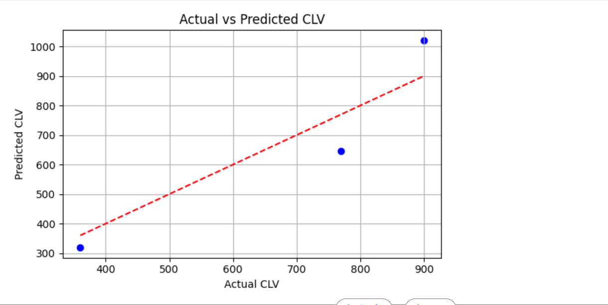

### Customer Lifetime Value (CLV) Predictor

### 📌 Project Overview

Customer Lifetime Value (CLV) represents the total revenue a business can expect from a customer throughout their relationship. It is essential for marketing optimization, customer segmentation, and ROI analysis.

This project builds a regression model to predict CLV using customer behavior features such as recency, frequency, and average order value.

### ✨ What This Project Demonstrates
📊 Regression Modeling: Predicts customer lifetime value using linear regression

📈 Behavioral Features: Uses recency, purchase frequency, and average order value

🧪 Model Evaluation: Measures performance using Mean Squared Error (MSE) and R² Score

📉 Visualization: Plots actual vs predicted CLV values

### 🎯 Purpose of This Project

This project provides a simple demonstration of how customer behavior metrics can be used to:

Predict customer lifetime value

Support data‑driven marketing decisions

Build foundational machine learning models for customer analytics

### 📸 Output Screenshot

